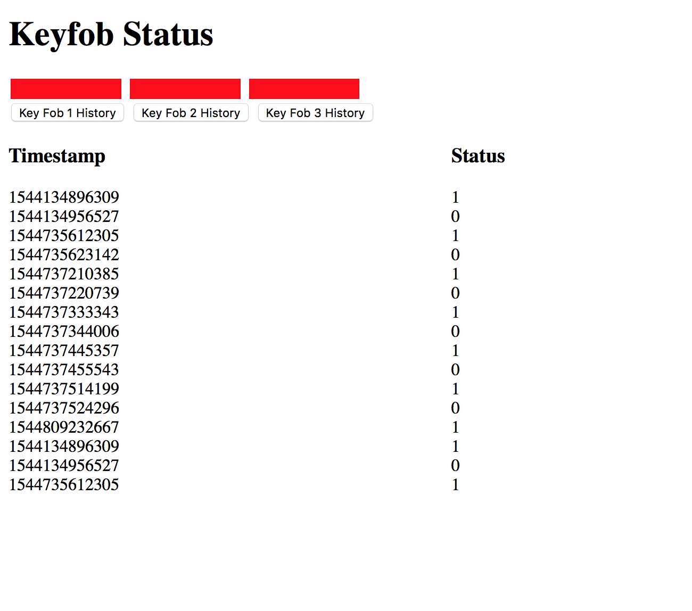

# Quest #5: Smart Key 12/7/2018

Author: Mahdiul Chowdhury, Carlos Callejas, Devin Chen

## Summary

Fob (HTTP server):

Each Fob is set up as an HTTPD server. Upon clicking the button, this triggers a GPIO interrupt that sets a volatile boolean flag as true. Upon being set as true, the fob transmits: start byte | "i" | fobID. The character "i" is a unique passcode character to our system. Once the node.js server logs the fob's access request, the fob now has access to a given resource, and a /POST request is sent to the fob, changing the "greenlight" boolean to true on the respective fob. After 10 seconds, the access expires and another /POST request is sent, this time setting the boolean as false.

Hub (HTTP client): 

The Hub is set up as an HTTPD client on our router, upon receiving a new connection over UART/infrared, it checks for the start byte (0x0A) and a matching passcode character unique to our system ("i"), and sends a /POST request containing the received ID to the node.js server responsible for data logging. 

Node server w/ TingoDB:

There is an server running that handles incoming POST requests from the hub. On receiving a request, it looks at the id and activates the appropriate event handlers for that id. It logs the status into the database along with hubid, fobid, timestamp and name. It also sends a post request to the fob which has the ip hardcoded in the server. Also the timeout function expires after 10 seconds and then relogs the data and sends a shutoff led to the fob.

Security:

The reason we decided to keep our verification system short (1 byte) is due to infrared data corruption. The issue could have been due to our BAUD rate (1200), attempts done with 2400 BAUD resulted in worse performance, the hub would simply not detect any data, implying either corruption of the start byte or passcode byte. Even if the start and passcode bytes were correct, the received ID would be corrupted.
Using more passcode characters, and even encryption would have been a much more robust security solution. The issue with encryption keys is distributing them across our devices. Or if they were to be a set of "encryption patterns" hardcoded into all devices within our system, the corruption of the byte that tells the hub what encrpytion pattern was used would lead to problems once again.

## Sketches and Photos

The clientside page which shows status indicators and history for each fob

## Modules, Tools, Source Used in Solution

ESP-IDF examples:
* uart
* RMT
* http client
* http server

## Supporting Artifacts

- [Demo](https://drive.google.com/open?id=1ApoLlIAiHPnBeOpcLRhihYo1_HhHfMkN)

Reminders
Please remember to post a link to this report.md file on Piazza
Repo is private
