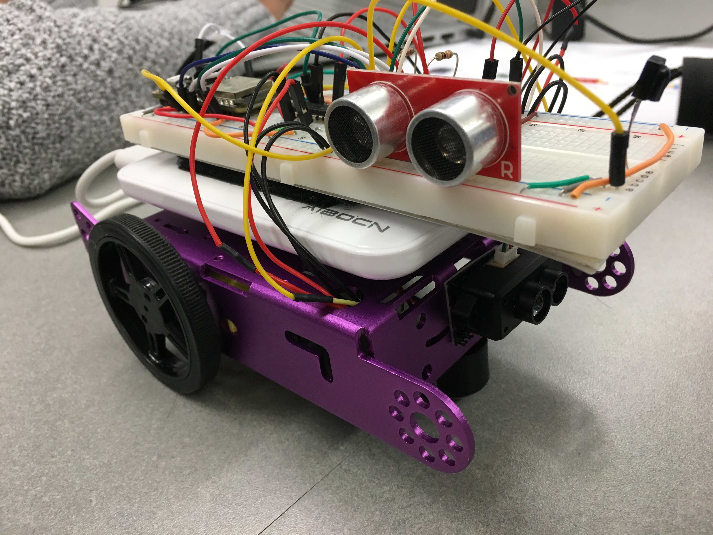
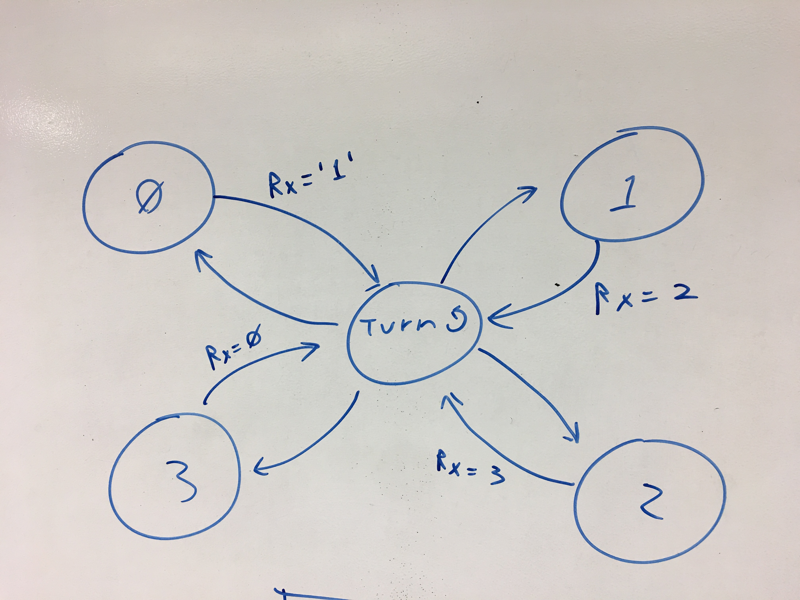

# Quest #4: Navigating a Car 16/11/2018

Author: Mahdiul Chowdhury, Carlos Callejas, Devin Chen

## Summary

For this quest we used the LIDAR as a front facing sensor to detect obstructions in front and the ultrasonic sensor on the right side using PID to keep constant distance from the wall. Our car is controlled using the proportional and derivative gains of a PID control algorithm, in conjunction with lidar readings. 

The motors on this car is drawing power separate from the ESP32 since we found that everything else connected to the board was drawing too much current for the motors to operate properly. There are two main functions we used for movement, forward and stopping. Each motor is on a different pwm configuration and has a separate duty cycle in order for us to control the speed of each motor for PID.

PID: 

Upon initializing, and after every turn, our car reads out distance to the wall using the Sparkfun Ultrasonic sensor, and stores it as its baseline or "commanded" distance. Once in motion, the car will measure the distance to the wall and calculate the error (baseline - measured) which is then used to compute the proportional and derivative components, which in turn are then all added into a single quantity labeled "output".

Depending on the error's sign, we select the appropriate motor to correct the car's trajectory (negative error implies we are moving left, and vice-versa). In order to convert this error in centimeters to a duty cycle for the motor, we divide the output by the baseline, multiply by +/-10 depending on error sign to keep the quantity positive, and add this quantity to a base correction duty cycle for the appropriate motor. The opposite side motor will be stopped to allow the direction to change.

(See code below:)

```
if (error > 2.0 && front_distance >= LIDAR_THRESH) // positive error means we are moving right (towards wall)
            {
                motor_stop(MCPWM_UNIT_0, MCPWM_TIMER_0); // L
                motor_forward(MCPWM_UNIT_1, MCPWM_TIMER_1, 60.0 + ((output/baseline) * 10.0)); // R
            } 
```

## Sketches and Photos


Wiring and setup


Early state diagram illustration

## Modules, Tools, Source Used in Solution

ESP-IDF examples:
* uart
* timer group
* mcpwm

## Supporting Artifacts

- [Explanation video](https://drive.google.com/open?id=18MveJQd4B2_8gurRB1CdRJm_35krtqUq)
- [In Class Demo](https://drive.google.com/drive/folders/1CMqP51b28YTGMkowZZaXwGW9CKCWRetu?ogsrc=32)

Reminders
Please remember to post a link to this report.md file on Piazza
Repo is private
